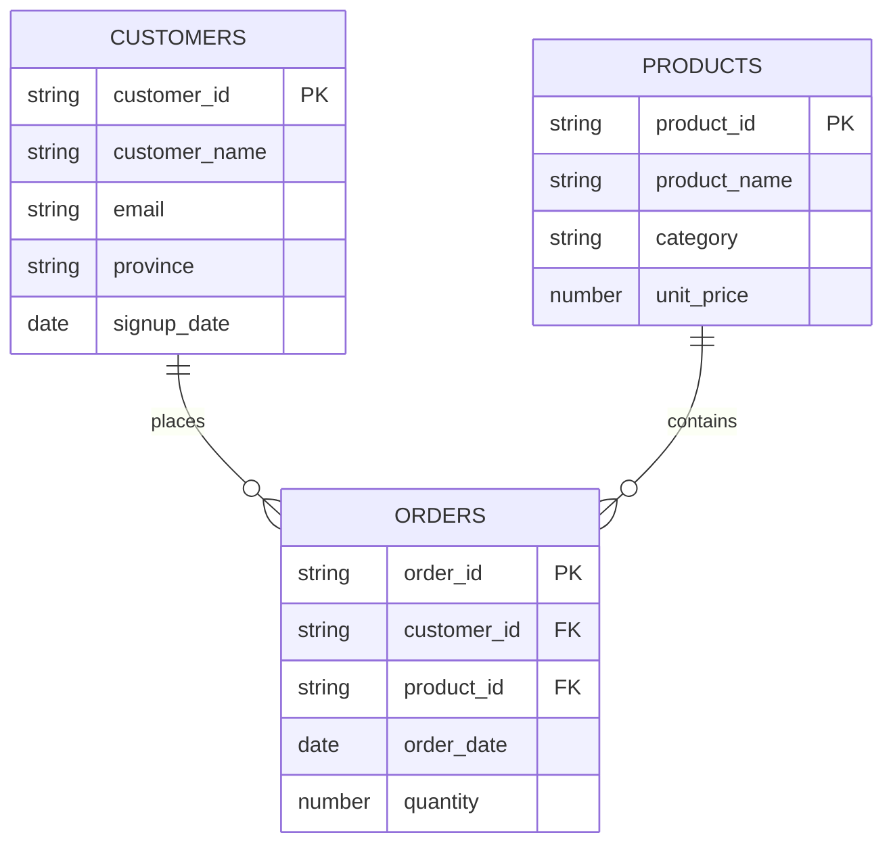
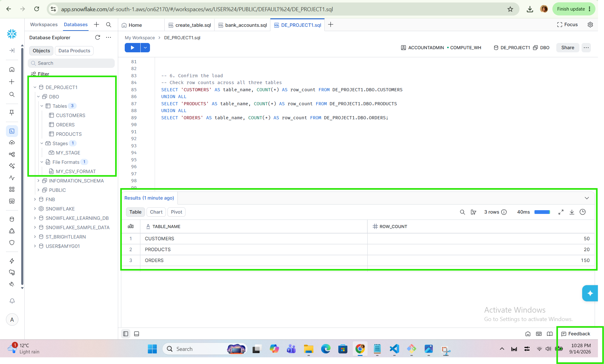
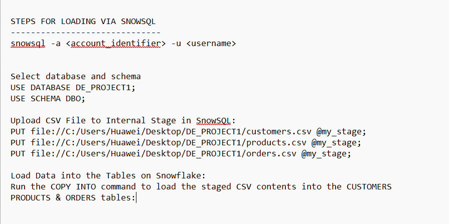
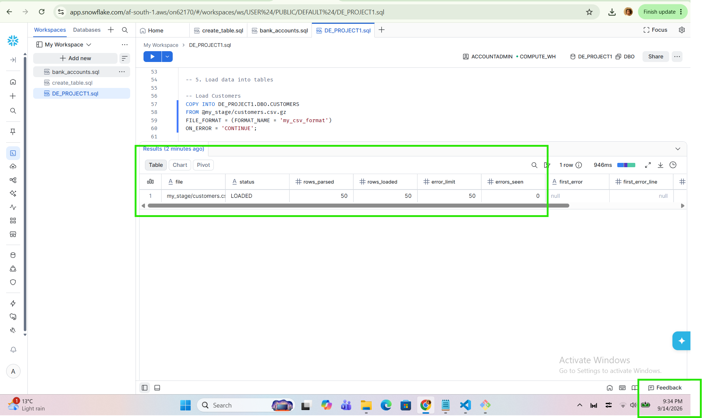
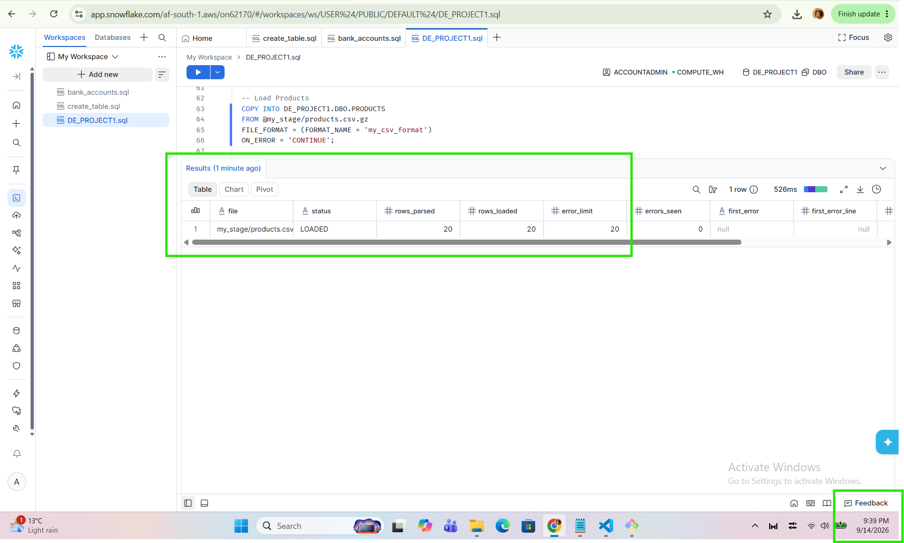
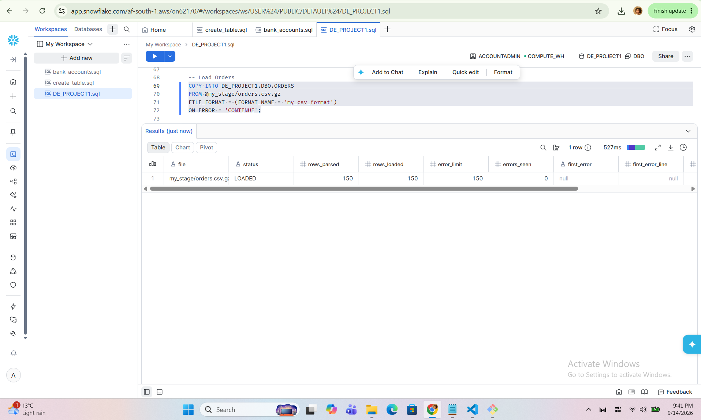

# Snowflake Data Engineering Project — Retail Sales Analysis

A small end-to-end data engineering project built entirely in **Snowflake**: designing a schema, loading raw CSVs via internal stages and `COPY INTO`, and writing SQL to turn raw transactional data into business-ready revenue insights.

## What this project demonstrates

- Designing a relational schema (dimension + fact tables) with correct data types
- Staging and bulk-loading CSV files into Snowflake using `PUT` (SnowSQL) and `COPY INTO`
- Validating a load with row-count checks
- Writing multi-table joins and aggregations to answer real business questions

## Data model

Two dimension tables (`CUSTOMERS`, `PRODUCTS`) and one fact table (`ORDERS`) linked by foreign keys:



| Table | Rows | Description |
|---|---|---|
| `CUSTOMERS` | 50 | Customer master data — name, email, province, signup date |
| `PRODUCTS` | 20 | Product catalogue — name, category, unit price |
| `ORDERS` | 150 | Transactional fact table — one row per order line |

## Database and schema

Everything lives in a dedicated database and schema so the project is self-contained and easy to find in the account:

```sql
CREATE DATABASE DE_PROJECT1;
USE DATABASE DE_PROJECT1;
CREATE SCHEMA DBO;
USE SCHEMA DBO;
```

Tables were created with explicit, purpose-fit data types rather than defaulting everything to `VARCHAR` — `NUMBER` for prices and quantities, `DATE` for date columns, and `VARCHAR` only for genuinely text fields (names, emails, IDs).


*`DE_PROJECT1.DBO` with the three tables (`CUSTOMERS`, `PRODUCTS`, `ORDERS`), the internal stage, and the CSV file format all visible in the Database Explorer, alongside the row-count confirmation query returning 50 / 20 / 150 as expected.*

## Loading the data

Files were uploaded to an internal stage and loaded with SnowSQL, then confirmed with `COPY INTO`:


*Connecting via SnowSQL, selecting the database/schema, and `PUT`-ing each local CSV to the internal stage `@my_stage` before running `COPY INTO`.*

```sql
-- Load Customers
COPY INTO DE_PROJECT1.DBO.CUSTOMERS
FROM @my_stage/customers.csv.gz
FILE_FORMAT = (FORMAT_NAME = 'my_csv_format')
ON_ERROR = 'CONTINUE';
```


*`COPY INTO` result for `CUSTOMERS`: 50 rows parsed, 50 loaded, 0 errors.*


*`COPY INTO` result for `PRODUCTS`: 20 rows parsed, 20 loaded, 0 errors.*


*`COPY INTO` result for `ORDERS`: 150 rows parsed, 150 loaded, 0 errors.*

All three loads completed with zero rejected rows, and the counts match the source files exactly.

### Confirming the load

```sql
SELECT 'CUSTOMERS' AS table_name, COUNT(*) AS row_count FROM DE_PROJECT1.DBO.CUSTOMERS
UNION ALL
SELECT 'PRODUCTS' AS table_name, COUNT(*) AS row_count FROM DE_PROJECT1.DBO.PRODUCTS
UNION ALL
SELECT 'ORDERS' AS table_name, COUNT(*) AS row_count FROM DE_PROJECT1.DBO.ORDERS;
```

| Table | Row count | Expected |
|---|---|---|
| CUSTOMERS | 50 | ✅ 50 |
| PRODUCTS | 20 | ✅ 20 |
| ORDERS | 150 | ✅ 150 |

## Queries

### 1. Order detail join

```sql
SELECT 
    o.order_id,
    o.order_date,
    c.customer_id,
    c.customer_name,
    c.email,
    c.province,
    p.product_id,
    p.product_name,
    p.category,
    p.unit_price,
    o.quantity,
    (o.quantity * p.unit_price) AS total_amount
FROM ORDERS o
JOIN CUSTOMERS c 
    ON o.customer_id = c.customer_id
JOIN PRODUCTS p 
    ON o.product_id = p.product_id;
```

This query flattens the star schema back into a single, analysis-ready row per order line: it pulls the customer's name, email, and province from `CUSTOMERS`, the product's name and category from `PRODUCTS`, and calculates `total_amount` as `quantity × unit_price` on the fly rather than storing it redundantly. It's the foundation query the project is built on — every other query is effectively a grouped, aggregated view of this result set — and it matters because it's what a BI tool, dashboard, or downstream analyst would query directly to look at individual transactions in full context. All 150 order lines join successfully to a customer and a product, confirming the foreign keys are clean.

### 2. Revenue per customer

```sql
SELECT 
    c.customer_id,
    c.customer_name,
    SUM(o.quantity * p.unit_price) AS total_revenue
FROM ORDERS o
JOIN CUSTOMERS c 
    ON o.customer_id = c.customer_id
JOIN PRODUCTS p 
    ON o.product_id = p.product_id
GROUP BY 
    c.customer_id, 
    c.customer_name
ORDER BY total_revenue DESC;
```

This aggregates every order line up to the customer level, showing how much each of the 50 customers has spent in total. The top spender, Nomvula Coetzee (R11,721.14), spends only marginally more than the second-highest customer, Karabo Nkosi (R11,004.24) — the spread across the customer base is fairly gradual rather than dominated by one or two outliers. This matters commercially because it's the query a business would use to identify its most valuable customers for loyalty programs, retention efforts, or account-based marketing, and to spot where revenue concentration risk might sit.

### 3. Revenue per category

```sql
SELECT 
    p.category,
    SUM(o.quantity * p.unit_price) AS total_revenue
FROM ORDERS o
JOIN PRODUCTS p 
    ON o.product_id = p.product_id
GROUP BY 
    p.category
ORDER BY total_revenue DESC;
```

This rolls revenue up to the product category level instead of the customer level, joining only `ORDERS` to `PRODUCTS`. Beauty is the top-earning category at R87,091.16, followed by Home (R72,908.94), Fashion (R49,810.15), and Electronics (R47,524.61) — meaning Beauty alone generates almost twice the revenue of the lowest category. This view matters because it answers a different business question than query 2: not *who* is spending, but *what* is selling, which is what drives decisions on inventory, marketing spend, and which categories to expand or discontinue.

### 4. Top 5 customers by total spend

```sql
SELECT 
    c.customer_id,
    c.customer_name,
    SUM(o.quantity * p.unit_price) AS total_revenue
FROM ORDERS o
JOIN CUSTOMERS c 
    ON o.customer_id = c.customer_id
JOIN PRODUCTS p 
    ON o.product_id = p.product_id
GROUP BY 
    c.customer_id, 
    c.customer_name
ORDER BY total_revenue DESC
LIMIT 5;
```

This is query 2 narrowed to just the top 5 rows: Nomvula Coetzee, Karabo Nkosi, Naledi Ndlovu, Fatima Sithole, and Michael Els, ranging from R11,721.14 down to R8,968.17. Rather than making an analyst scroll through all 50 customers, it surfaces exactly the shortlist a sales or account management team would act on directly — for example, to prioritize outreach or offer early access to new products. It's a small change technically (a `LIMIT`) but it reflects a common real-world pattern: turning a full aggregation into a decision-ready shortlist.

## Files in this repo

| File | Contents |
|---|---|
| `order_detail_join.sql` | Query 1 |
| `revenue_per_customer.sql` | Query 2 |
| `revenue_per_category.sql` | Query 3 |
| `top_5_customers.sql` | Query 4 |
| `order_detail_join.csv` | Results of query 1 |
| `revenue_per_customer.csv` | Results of query 2 |
| `revenue_per_category.csv` | Results of query 3 |
| `top_5_customers.csv` | Results of query 4 |
| `images/` | Screenshots of the Snowflake setup, load, and validation steps |

## Tools used

Snowflake (database/schema/table design, internal stages, `COPY INTO`), SnowSQL (CLI-based file staging), and standard SQL (joins, aggregation, window-free `GROUP BY`/`ORDER BY`/`LIMIT` logic).
